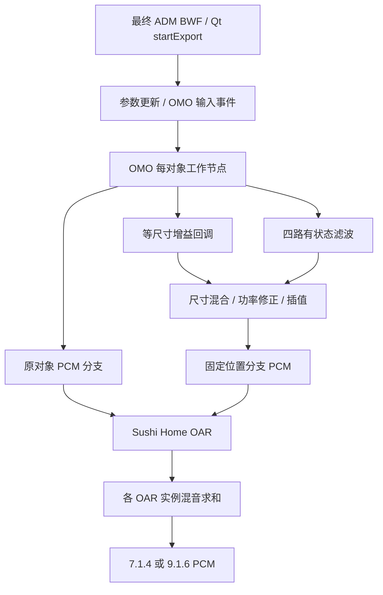

# Renderer 5.5 ADM re-render：尺寸调用链与增益采集

本页记录入口识别阶段。后续自有等尺寸内核与离线 CLI 的实现、验收见
[DAR_NATIVE_SIZE_ALIGNMENT.md](DAR_NATIVE_SIZE_ALIGNMENT.md)。

本轮交付的是经过 PCM 核对的正常渲染采集入口。它从同一最终 ADM BWF 记录预处理参数、尺寸增益、
滤波信号、混音输入和输出，不独立构造或调用一个脱离 Renderer 的 panner。该阶段非零尺寸尚为
`unsupported`；入口识别阶段没有修改渲染内核、GUI、实时接口、C ABI 或 22.2。

## 身份与证据范围

- Renderer：`5.5.0 release`，arm64。
- Mach-O UUID：`F11646CF-9535-3815-8184-524335D4CC3A`。
- 安装文件 SHA-256：`ec9432d6af6679cfdf5cc668d37be0b3ac295ea9453b264ec84e0d1706bb2390`。
- 静态 image base：`0x100000000`。下表是静态 VA；RVA 为减去此基址。
- 主要 IDA 9.1 数据库：`local/dar-gain-trace/renderer-arm64.i64`，定点导出放在相邻子目录。
- 二进制身份与运行时代码快照的来源：`binary.json`、`runtime/snapshot.jsonl`、`overlay.json`。

磁盘中的相关代码不是可直接使用的普通 arm64 指令；最初静态分析没有得到有效引用。对正常运行的
已授权进程做只读代码快照，并仅覆盖本地 IDA 数据库后，才获得可用的反汇编。安装文件及其 arm64
切片保持原样。`ida_gain_locator.py` 在分析前及新建函数后调用 `ida_auto.auto_wait()`，保存局部反汇编、
反编译、调用点及 RVA。`locate_gain_runtime.py` 同时记录字符串引用、RTTI、虚表与 compact unwind 边界。
反编译器的参数推断只作为线索；回调 ABI 已按实际指令中的寄存器传递核对。

入口同时检查安装文件哈希和进程已加载模块的 UUID、架构，按实际加载基址重定位，并核对原虚表指针。
版本或指针不匹配时拒绝安装。地址和反编译证据不能直接用于另一个 Renderer 版本。

## 实际命中的处理路径

| 环节 | 静态 VA / 入口 | 证据 |
|---|---|---|
| 离线图执行节点的调用点 | `0x101ed38f8` | OMO 与 OAR 记录的真实调用栈；与监听调用点 `0x101ed25e4` 区分 |
| OMO 每对象节点 | `0x101e54840`，虚表槽 `0x103d15920` | 实际命中；节点 `+72` 是对象索引，`+80` 指向平台上下文 |
| 工作节点处理 | `0x101e55970 → 0x101e6d960 → 0x101e6b2ac` | 运行栈、输入 PCM、对象状态和消费者互相对应 |
| 预处理到整数元数据 | `0x101e6e754` | 输入 72-byte 事件、输出 60-byte 回调参数及调用点对应 |
| 尺寸混合控制 | `0x101e6f0cc` | 在 `0x101e6f250` 实际调用尺寸增益回调；读到其使用的增益与 PCM |
| 尺寸增益回调 | `0x101e6d374 → 0x101e5f4dc → 0x101e598b0` | 真实回调命中，记录完整 60-byte 参数、布局描述及 11 个增益 |
| 尺寸功率修正 | `0x101e6e9b8` | 用捕获回调输出重建 OMO target 增益，误差达到 float 精度量级 |
| 滤波与混音消费者 | `0x101e6c380 / 0x101e6cb28 / 0x101e6b824` | 捕获四路滤波 PCM、正负号、混合系数、前后增益和插值权重，重建固定分支 PCM |
| OMO 合并节点 | `0x101e54774 → 0x101e6dd60`，虚表槽 `0x103d158e0` | 实际命中；合并后的分支逐样本等于 OAR 对应输入 |
| Sushi Home OAR | `0x101e3ebcc`，虚表槽 `0x103d14ef0` | 实际命中；输入选择、点源增益、输出缓冲区与最终 WAV 对应 |
| OAR 内部混音 | `0x101e41618` | 读取每输入 48-byte 增益状态，含 current、target、step、剩余步数 |

`0x101e5f4dc` 只在记录到的 enabled、type=3 条件下调用 `0x101e598b0`；已捕获的尺寸参数满足此条件。
它与 OAR 的另一份 panner 实现有相似结构，不能因为相似就混用地址或状态布局。

本批输入是 10 条静音 bed 加 1 个合成 Objects PCM。OMO 产生 11 条原对象/bed 分支和 44 条固定位置分支。
后者分为四组，每组 11 个非 LFE 位置；本批实际尺寸信号使用其中一组。四组元数据类别的全部语义尚未
验证，报告保留原始分组字段，不把它们命名成新的公开模式。

以下候选已区分：

- `homeSpeakerGains` / `cinemaSpeakerGains` 出现在房间配置的序列化与 trim 字段中，不能当成对象增益。
- `Cinema::TorchLightPanner` 的已识别 gain 槽在本批正常 ADM 导出中零命中。
- `DassidkDolby::Atmos::Home::OarAdapter` 在对照追踪中零命中；实际命中的是 `Dolby::Sushi::Home` 版本。
- `Spectral Decorrelator` 的名字不足以证明使用该模块。已验证的尺寸滤波由 OMO 内部路径产生。
- OMO 和 SpatialCoder 的 `SingleNode` 均不能代替本次实际使用的 OMO 多线程节点。

## 字段与组合规则

原始事件与内存记录都保留十六进制字节、运行时地址、线程、对象索引和调用栈；未确认字节不按 float
解释或猜名称。`gain-validation.json` 把有效记录关联到 AXML 的 object ID、track UID、PCM 索引及事件时间。

| 结构 | 已确认字段 |
|---|---|
| 最终 ADM | PCM payload、AXML、CHNA 和整个 BWF 分别保存哈希；解析对象绑定、XYZ、三轴 size、时间与原 XML |
| OMO 输入事件，72 bytes | `+0` 对象索引；`+8` PCM 指针；`+36/+40/+44` 为内部 XYZ；`+52` 为预处理后 size |
| OMO 对象状态，144 bytes | `+24/+32` 尺寸 target/previous 增益指针；`+40/+44` 原对象 target/previous 系数；`+48/+56` 另一组增益指针；`+64/+68` 配套原对象系数；`+124` 缓存 size |
| 尺寸回调事件，60 bytes | `+0` type；type=3 时 `+4/+8/+12` 为整数 XYZ，`+16/+20/+24` 为等尺寸的三个整数值；位置与尺寸按 32768 尺度转换、正上界 32767；其余标志及 gain code 保留原值 |
| OMO 工作上下文 | `+24/+40` 为 target/previous 插值权重；`+48` 为私有 panner dispatch 表；`+80` cutoff 本批为 0.2 |
| OAR 输入选择 | 分组容器中的全局 PCM 索引连接 OMO 输出与 OAR 输入，不凭对象地址推断源通道 |
| OAR 增益状态，每输入 48 bytes | `+0/+8/+16/+24` 指向 current/target/step/steps-left；后续 scalar 状态原样保存 |

ADM 坐标先对应内部 `((X+1)/2, (1-Y)/2, Z)`；有运动或尺寸变化时，捕获到的有效值还带有前处理的时间变化。
记录中的 `sample_start` 是该离线节点处理块的起点，不等于参数变化发生的精确采样时刻。不会移动 PCM
来让时间一致；同一采样区间的输入 PCM 必须直接匹配最终 BWF。原点、边界以及从非零尺寸回到零的过程
均保留真实有效参数。

本批配置下，原对象系数为 `cos²(pi/2 * min(size/0.2, 1))`，尺寸分支先乘相应的 `sin²` 系数。
随后还有 `0x101e6e9b8` 的功率修正，包含与 size 成比例的 1.2 dB 项，前三声道和其余声道的处理不同。
因此仅乘尺寸混合系数仍然不够。`measure_gain_trace.py` 用这条已观察到的后处理验证回调数据，没有拟合
新的空间增益表。

捕获的四路滤波来自四级、四路并行的有状态全通结构：本批 48 kHz 的延迟长度为 152、200、263、346，
系数绝对值 0.4，各路符号不同。混音还按输出位置选择滤波路与符号；当前配置的两个混合系数约为
0.92195445 和 0.38729835，中心槽位走其明确的特殊分支。初始化与静音尾段由原引擎推进，本次没有把它
替换成无状态 FIR 或自行归一化。

这解释了小尺寸 9.1.6 仍有额外声道：尺寸分支使用固定 11 个位置，但原对象分支仍能路由到宽声道和顶中声道。
size 约到 0.2 时，原对象分支系数才趋近零。早期“任何非零 size 都折叠到 7.1.4”的表述已撤回。

## 捕获方式与生命周期

持续附加 LLDB 的原型已实现，但本机 Renderer 正常执行会产生自身处理的 Mach 异常。即使没有研究断点，
持续附加的控制导出也失败；`baseline916*` 保留错误。`EXC_BREAKPOINT` pass-through 设置在本机 LLDB 不可用。

可工作的适配器用**一次 LLDB 附加**装入驻留 Qt 桥后立即分离，在原 Qt 事件循环完成后续动作。
没有反复附加来执行每个导出动作。普通虚表包装器只转发原调用并记录数据；尺寸 callback 槽仅在对应
OMO 工作线程的一次原调用期间替换，正常返回或 C++ 异常展开时立即恢复。没有在断点回调中调用引擎方法，
也没有改变 PCM、元数据、安装二进制或许可证逻辑。

关键约束：

- 工作上下文属于调度器线程；PCM、四路滤波和 scratch 只在该原调用返回前复制。不能在回调后保存裸指针供外部使用。
- 后台监听与离线图可能复用对象地址。采样计数只针对已确认的离线调用栈，不能只用 `self` 地址判断生命周期。
- 布局暂存与提交在同一个 Qt 动作中完成，防止母版的异步刷新撤回暂存状态。
- 结束时恢复虚表指针与内存页保护、母版、布局、导出设置，并核对 key 24／251 的持久化哈希。
- `batch` 通过正常母版初始化推进上下文；独立构造/销毁 panner、外部线程直调和脱离进程的缓冲区契约尚未交付。

## 验证与复现

一键命令和依赖见 `scripts/research/dar_layouts/README.md`。最终套件在
`local/dar-gain-trace/verified-suite/`；每个 trace 目录有 `summary.json`、`adm-verification.json`、
`gain-validation.json`、完整 trace 以及导出/恢复记录。`suite-report.json` 汇总两布局及重新初始化复测。

18 个事件在两布局、各两次重新初始化导出中全部覆盖，参数和增益逐项一致。四次有追踪 PCM 均与各自
无追踪控制逐样本一致；原状态及 key 24／251 均恢复。实测最大绝对误差：

| 验证环节 | 两布局最大值 |
|---|---:|
| size 回调输出 → OMO target 增益 | `5.89e-8` |
| 原对象混合系数 | `7.87e-8` |
| 重建 OMO 原对象 PCM | `1.15e-8` |
| 重建 OMO 尺寸分支 PCM | `1.24e-8` |
| OMO 输出 → OAR 输入 | `0` |
| OAR 混音求和 → 最终 24-bit WAV | `7.83e-8` |

Release 点源回归在前方、原点和内部点通过原定 1% / 0.02 门槛。上述结果验证采集入口与数据流，
不表示自有尺寸空间算法已经通过此前的能量、频谱和运动验收。

验收逐级检查：

1. 同一最终 ADM 的无追踪和有追踪导出，全文件 decoded PCM 哈希相同，状态恢复成功。
2. 回调 11 维增益经过实测后处理后，匹配 OMO 的 target 增益和原对象系数。
3. 从捕获的输入、滤波路、符号、权重及前后增益重建 OMO 分支 PCM。
4. OMO 输出逐样本匹配 OAR 所选输入；各 OAR 输出求和匹配最终 WAV，仅保留 24-bit 输出量化误差。
5. 两次独立母版/引擎初始化后，参数、增益、采样位置记录相同，18 个事件全部有有效记录。
6. 使用 Release `mradm` 渲染 `spread=none`，只在 size=0 区间核对原点源回归。

`oar_constant_gain_pcm_max_abs_error` 是额外诊断值：在 OAR 的增益插值块中，单个块末 target 向量无法预测整块
PCM。它没有替代上述时间相关的真实混音缓冲区核对，也不作为静态尺寸模型的成绩。

小型真实记录回归位于 `scripts/research/dar_layouts/fixtures/omo_gain_mix.json`（32 个采样、带原始身份信息）。
套件的 `regression-audio/` 还保存每个事件的 512-sample PCM 片段及原时间位置；当前三份 WAV 合计约 1 MB。
`storage-manifest.json` 记录无损压缩及逐样本相同的重复音频清理，参考控制仍保留。压缩后重新分析两布局
通过相同检查；本轮整理回收约 1.3 GB，并保留一个主要 IDA 数据库及全部失败日志。
运行 `python3 -m unittest discover -s scripts/research/dar_layouts -p 'test_gain_trace.py' -v`。
早期失配、零命中、布局时序与实例地址复用失败保留在 `local/dar-gain-trace/`，不得当作通过案例。
