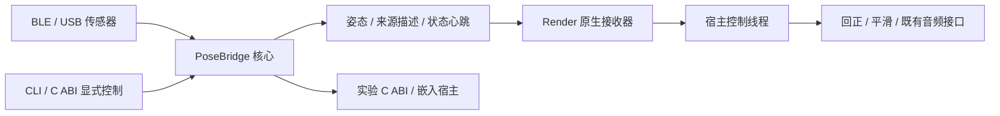

# 头部追踪与 OSC 跨仓库设计

状态：PoseBridge 核心库／CLI／C ABI 与 MacinRender 原生接收器已实现；GUI 接入、个人安装验收和音频整体延迟后置。
更新：2026-09-19。决策依据：[ADR 0009](../adr/0009-head-tracking-input-boundary.md)。

## 仓库与责任

PoseBridge 是独立 Rust Cargo workspace：posebridge-core、posebridge-cli、posebridge-capi。
macOS Apple Silicon／Windows x64，BLE 使用 btleplug／Tokio，USB 使用 tokio-serial，OSC 使用 rosc，CLI 使用 clap，C 头文件使用 cbindgen。
MacinRender 消费规范化姿态，提供回正、平滑、来源仲裁和音频渲染。设备侧校准与安装映射归 PoseBridge；听音正前方回正归宿主。

OSC 只上报；设备控制只通过 CLI 或嵌入 C ABI。忙时先停止采集再执行操作，操作后由调用方显式启动。
不通过 OSC 写设备参数，不自动切算法、校准、保存或恢复默认。

## 当前接口

维护者确认此前草案没有实际消费者，0.3 统一了协议与快照：只支持当前协议 3，旧地址／结构／版本选择开关已移除。
MacinRender 对应头追 ABI 1.42；既有音频 API 与 SONAME 不变。完整协议和接收规则见[原生接口文档](OSC_HEAD_TRACKING_API.md)。

PoseBridge 提供：来源描述、inspect 只读配置查询、结构化操作结果、原子快照、独立状态心跳、分层计数、
模拟姿态，以及显式回传率、输出格式、算法、校准、参考、归零、保存和恢复默认命令。
真实读取只在停止采集时执行；运行中提供带观察时间和有效性标记的缓存。
unknown/null 不表示设备已校准或功能已在该硬件验证。

来源的逻辑标识、运行实例、设备连接会话、姿态参考代次和设备时钟代次分别记录。
跨进程未观察到的校准不猜测原因；重连或可能改变参考的操作让宿主知道应检查回正。
原生接收器不持有音频对象、不主动调用 Monitor/Scene，不增加 GUI 依赖。

## 设备与坐标

首款设备 BWT901BLECL5.0，实物广播 WT901BLE68，已读设备版本号 13115。
[官方规格](https://wit-motion.yuque.com/wumwnr/docs/xg00zfvpuf7m45y0)、[新版协议](https://wit-motion.yuque.com/wumwnr/docs/qnpb2lo3f0orduqe)、
[该型号校准协议](https://wit-motion.yuque.com/wumwnr/docs/gpare3)与[SDK](https://github.com/WITMOTION/WitBluetooth_BWT901BLE5_0)作为依据。
产品标称 0.2° 指俯仰／横滚，不作为全部轴、最终佩戴或动态精度保证。

BLE 服务 FFE5、通知 FFE4、写入 FFE9 使用 Bluetooth 基础 UUID；Mac 标识是不透明 UUID，不要求 MAC。
USB 115200 8N1 无流控。默认 55 61 为 20 字节；支持 0x81（16 字节时间＋角度）、0x84（18 字节时间＋四元数）、
0xA4（24 字节时间＋角速度＋四元数），以及固定 20 字节寄存器回复。未验证长输出不默认开启。

设备 XYZ Euler 解释为 Rz(Z) Ry(Y) Rx(X)，安装基底 M 给出头部右／前／上的传感器轴，先做 M R M^T。
输出沿用 GUI 的 Hamilton XYZW，q=q_y(yaw) q_x(pitch) q_z(roll)，yaw 左、pitch 上、roll 右倾。
这个四元数不是渲染场景的原始物理 XYZ 表示；宿主按现有 listener setter 提交 Euler。
q 与 -q 等价；回正与插值使用短弧。软件向量测试不代替佩戴后的三轴方向验证。

现有代码依据：

- [IHeadTrackingSource](../../gui/MacinRender.Gui/Services/HeadTracking/IHeadTrackingSource.cs)
- [HeadTrackingManager](../../gui/MacinRender.Gui/Services/HeadTracking/HeadTrackingManager.cs)
- [ManualFreeLookSource](../../gui/MacinRender.Gui/Services/HeadTracking/ManualFreeLookSource.cs)
- [HeadRotation](../../src/adm_render_common/head_rotation.h)

## 时效与验收

设备每采样推进 5 ms 已在 200 Hz 档验证，但 BLE 约每秒 25 批。USB 交付受平台驱动与读取批次影响，采样率和 OSC 率分别记录。
每个数据报一份最新姿态，慢消费者不重放历史队列；无有效姿态 500 ms 停止保活，心跳用独立 3 秒期限。
源停留时间、设备日历和 Render 接收时间含义分开，未实现时钟同步、预测或延迟补偿。

数据与操作的协议／ABI／生命周期由软件测试覆盖；macOS／Windows USB 与 BLE 分别记录真机结果。
校准、参考保存、恢复默认及掉电持久化需要独立验收，常规测试不会自动执行这些动作。
MacinRender GUI、Mesh2HRTF 个人 SOFA、磁干扰、长期漂移和运动到声音总延迟不由接口测试代替。
