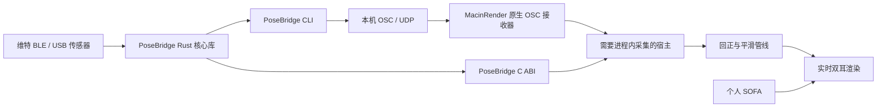

# 头部追踪与 OSC 跨仓库设计

> 状态：PoseBridge 与 MacinRender 原生 OSC 接收接口已实现；GUI 适配尚未实现。平台实测与音频验收分别记录。
> 日期：2026-09-17；更新：2026-09-19。
> 决策依据：[ADR 0009](../adr/0009-head-tracking-input-boundary.md)。
> 本文保留跨仓库设计；原生接收接口见 [OSC_HEAD_TRACKING_API](OSC_HEAD_TRACKING_API.md)。PoseBridge 的实际接口以独立仓库 README、docs/protocol.md 和 include/posebridge.h 为准。

## 1. 目标与当前基础

首版使用 BWT901BLECL5.0 获取头部旋转，经本机 OSC 驱动 MacinRender 双耳监听。
Mesh2HRTF 提前生成个人 SOFA；播放期间由本机更新头部朝向、查询 HRTF 并渲染声音。
一个世界固定的正前方声源，在听者向左转头后应出现在听者右侧。

首版覆盖 macOS Apple Silicon 和 Windows x64，追踪 yaw、pitch、roll 三个旋转自由度。
位置追踪、Mesh2HRTF 求解、系统级音频捕获、桥接工具 GUI 和局域网多设备路由留到后续。

| 能力 | 当前状态 | 首版接入方式 |
|---|---|---|
| 手动姿态、AirPods/CoreMotion 来源 | 已有实现 | 保留现有来源 |
| 四元数回正、平滑、视觉与音频姿态更新 | 已有实现 | 复用头追踪管线 |
| SAF 双耳加载个人 SOFA | 已有实现 | 使用兼容的双耳、48 kHz FIR SOFA |
| 维特 BLE / USB 采集、Rust CLI、C ABI | Rust 初版已实现；实机验证按平台记录 | 独立 PoseBridge 仓库 |
| 通用 OSC 姿态输入 | 原生 C++／C ABI 已实现；GUI 待适配 | 独立接收器，宿主轮询 |
| 真机刷新率、磁干扰、整体延迟 | 待验证 | 两个平台分别记录实测结果 |

当前代码入口：

- [IHeadTrackingSource](../../gui/MacinRender.Gui/Services/HeadTracking/IHeadTrackingSource.cs)：来源输出四元数，事件在 UI 线程触发。
- [HeadTrackingManager](../../gui/MacinRender.Gui/Services/HeadTracking/HeadTrackingManager.cs)：回正、Slerp、死区和角度输出。
- [ManualFreeLookSource](../../gui/MacinRender.Gui/Services/HeadTracking/ManualFreeLookSource.cs)：现有角度到四元数的构造依据。
- [SemanticEditorViewModel](../../gui/MacinRender.Gui/ViewModels/SemanticEditorViewModel.cs)：来源仲裁、16 ms 轮询和约 250 ms 音频保活。
- [HeadRotation](../../src/adm_render_common/head_rotation.h)：渲染端世界坐标到头部坐标的旋转。

原生 OSC 协议／生命周期测试不代替维特安装或音频验收。源码部分旧注释仍写约 33 Hz，当前 GUI 定时器实际配置为
16 ms；它也不代表音频回调频率或未来 BLE 输入频率。

## 2. 仓库与运行边界

独立项目名称为 **PoseBridge**，已建立本地 Rust 仓库。本仓库保存设计与协议快照，独立仓库承接设备实现和协议维护，
MacinRender 按协议版本引用它，双方共享测试向量，不通过源码复制维持兼容。



| 责任 | PoseBridge | MacinRender |
|---|---|---|
| BLE 权限、USB 串口、扫描、连接、重连 | 负责 | 消费 OSC，无需 BLE 权限 |
| 设备寄存器、校准、原始数据解析 | 负责 | 不接触设备协议 |
| 安装方向与姿态约定转换 | 负责 | 校验统一姿态 |
| OSC 发送、诊断与模拟输入 | 负责 | OSC 接收与状态展示 |
| 听音正前方回正、用户侧平滑 | 不重复施加 | 复用现有管线 |
| SOFA、ADM、音频设备与渲染 | 不参与 | 负责 |

MacinRender 首版通过 OSC 集成。PoseBridge C ABI 面向需要进程内采集的宿主，
不作为当前 GUI 的新增原生依赖；CLI 和 C ABI 调用同一 Rust 核心逻辑。
当前 `adm_*` C ABI 继续复用 listener orientation setter；v1.40 新增独立 OSC 接收句柄和快照，
不增加蓝牙依赖或 PoseBridge 原生类型。接收线程不直接调用 Monitor／Scene 控制接口。

## 3. PoseBridge 实现组成

PoseBridge Cargo workspace 包含三个 crate：

| crate | 职责 |
|---|---|
| `posebridge-core` | BLE / USB、维特协议、安装配置、姿态快照、诊断、模拟来源和可选 OSC 输出 |
| `posebridge-cli` | 参数、命令、输出与退出处理；直接调用核心库 |
| `posebridge-capi` | C 类型、句柄、缓冲区、错误和线程边界；输出 `cdylib` 与 C 头文件 |

选用 `btleplug` 访问 CoreBluetooth / Windows BLE，`tokio-serial` 访问 USB 串口，Tokio 管理异步任务，`rosc` 编码 OSC，
`clap` 提供 CLI，`cbindgen` 生成头文件。实际版本固定于 PoseBridge 的 Cargo.lock；发布时审查所选版本许可证。
公开厂商示例作为协议依据；复制或再发行代码前须确认对应许可证。

核心库保存最新完整姿态快照，包含本次采集会话标识、递增采样序号、主机单调接收时间、统一四元数及来源类型。
主机接收时间不是传感器采样时间；重复读取同一快照不得产生新采样序号。
BLE 输入、OSC 输出和 C ABI 快照共用这一数据源，慢消费者不积累历史姿态队列。

平台约束：

- macOS：首批构建目标 `aarch64-apple-darwin`。CLI 的宿主终端需获蓝牙权限；嵌入宿主或应用包须配置
  `NSBluetoothAlwaysUsageDescription` 并取得授权。设备选择使用 CoreBluetooth 提供的不透明标识，不强求 MAC 地址。
- Windows：首批构建目标 `x86_64-pc-windows-msvc`。通过系统 BLE API 使用兼容适配器；实际发现、连接和权限行为须真机验收。
- 显示设备名称便于识别，但名称不作为唯一身份；多台同名设备必须显式选择平台设备标识。
- `stop` / Ctrl+C 取消扫描、读取和重连任务，解除通知订阅、关闭连接并退出运行时；不以杀进程作为正常停止方式。

## 4. 首款设备与 BLE 协议依据

### 4.1 标称参数与待测项

下表来自 2026-09-17 核对的[旗舰店商品页面](https://detail.tmall.com/item.htm?id=598073228676)。
同一页面包含多个型号，以下采用所选 BWT901BLECL5.0 的详情图，均为商家标称值。

| 项目 | 标称信息 | 接入时的处理 |
|---|---|---|
| 通信 | BLE 5.0；Type-C 图示包含供电与传输 | 首版支持 BLE 与 USB 串口，共用 20 字节解析器 |
| 输出 | 加速度、角速度、磁场、角度、四元数 | 姿态数据为主，原始量用于诊断 |
| 回传 | 0.2–200 Hz，默认 10 Hz | 默认 OSC 上限目标 100 Hz；设备速率只经显式 configure 命令改变 |
| 俯仰 / 横滚 | 0.2° | 不能推广为所有轴均有该精度 |
| 航向 | 九轴静态约 1°，无磁干扰条件下 | 需在耳机安装位置测试 |
| 六轴航向 | 静态约 0.5°，动态存在累计误差 | 不视作长期无漂移保证 |
| 重量 | 详情图约 18.88 g；参数栏另写 6 g | 整机佩戴重量待核实 |
| 续航 | 宣传约 30 小时 | 高频连续传输时长待实测 |

PoseBridge 的后续实验已确认本机固件可在 200 Hz 档主动上报原生四元数与设备时间戳，但 BLE 仍约 25 批/秒；正式桥接默认仍使用角度流。详见 [BLE 探索记录](https://github.com/SakuzyPeng/PoseBridge/blob/main/docs/measurements/2026-09-19-ble-exploration.md)。200 Hz 的内部时间戳步长不代表转头到声音的总延迟。
磁力计可能受到耳机单元磁铁或周围金属影响；安装使用非磁性固定件，并分别记录静止漂移与转动后回正误差。

### 4.2 GATT 与数据帧

协议依据固定为[官方 BLE 5.0 SDK 的 Python 解析器](https://github.com/WITMOTION/WitBluetooth_BWT901BLE5_0/blob/9efaab0fdd6a06dc807bf80402e58aa91b431c6f/Python/BWT901BLE5.0_python_sdk/device_model.py)，
提交 `9efaab0fdd6a06dc807bf80402e58aa91b431c6f`。这是该系列示例协议，接入时仍须验证实际设备的服务与特征属性。

| 用途 | UUID |
|---|---|
| 服务 | `0000ffe5-0000-1000-8000-00805f9a34fb` |
| 通知特征 | `0000ffe4-0000-1000-8000-00805f9a34fb` |
| 写入特征 | `0000ffe9-0000-1000-8000-00805f9a34fb` |

示例解析器使用 20 字节帧。以下偏移均从 0 开始，多字节整数为小端有符号 `int16`：

| 帧 / 字段 | 字节位置 | 解码 |
|---|---|---|
| 连续运动帧 | `55 61` 开头 | 后续含三轴加速度、角速度、角度 |
| 加速度 X/Y/Z | 2–7 | `raw / 32768 × 16`，单位 g |
| 角速度 X/Y/Z | 8–13 | `raw / 32768 × 2000`，单位 °/s |
| 角度 X/Y/Z | 14–19 | `raw / 32768 × 180`，单位 ° |
| 寄存器响应 | `55 71` 开头 | 按返回的寄存器地址解析 |
| 四元数响应 | 示例检查字节 2 为 `0x51` | 字节 4–11 为 Q0/Q1/Q2/Q3，各除以 32768 |
| 磁场响应 | 示例检查字节 2 为 `0x3A` | 与四元数分开读取，用于诊断 |

官方示例以 `FF AA 27 51 00` 读取四元数起始寄存器，并交替读取磁场、四元数，中间有 100 ms 等待。
因此示例读取循环不能作为高频四元数性能依据，也不能把上一份四元数伴随每个新角度帧重复标记为新姿态。
Q0…Q3 的分量语义、旋转方向及欧拉角旋转顺序，应结合[厂商协议说明](https://wit-motion.yuque.com/wumwnr/ltst03/rorzux5fl78bswi3)
和实机动作确定，不能仅凭四个数的存储顺序猜测。

首版默认使用连续角度帧，完成安装映射后构造统一四元数；直接读取设备四元数作为显式可选模式。
配置回传率时依据目标固件的寄存器说明，失败应报错并报告当前状态，不把请求速率显示为已生效速率。
校准和保存设备参数是显式操作；连接或回正不触发自动校准、固件升级或永久参数写入。

解析器应处理拆包、粘包、未知类型及重新同步。示例中的帧头检查不是完整完整性保证；实现须按确认后的协议
校验长度和字段范围。BLE 接收与轮询全部使用异步等待，不照搬示例中的阻塞等待方式。

## 5. 统一姿态与安装转换

### 5.1 面向 MacinRender 的姿态约定

OSC 与 C ABI 采用同一姿态约定：角度为度，yaw 正值表示向左转头，pitch 正值表示抬头，
roll 正值表示向右侧倾。以数据源自身参考方向为基准；听音正前方由接收端回正确定。

四元数采用 Hamilton 乘法，传输分量顺序为 **x、y、z、w**，单位姿态为 `(0, 0, 0, 1)`。
它是当前 GUI 的姿态表示，与 `System.Numerics.Quaternion.CreateFromYawPitchRoll` 对齐：

```text
q = q_y(yaw) * q_x(pitch) * q_z(roll)
R = R_y(yaw) * R_x(pitch) * R_z(roll)
```

这里是列向量的主动旋转表示，右侧旋转先应用；构造时先将度转换为弧度。
这些 x/y/z 是 GUI 姿态表示的分量轴，不能直接当作 SOFA 或音频场景的空间轴。
`q` 与 `-q` 表示同一姿态；插值和变化判断需使用这一等价关系，跨 ±180° 时走短弧。

从单位四元数恢复 GUI 角度的规则与当前管理器一致：

```text
pitch = asin(clamp(2 * (w*x - y*z), -1, 1))
yaw   = atan2(2 * (x*z + w*y), 1 - 2 * (x*x + y*y))
roll  = atan2(2 * (x*y + w*z), 1 - 2 * (x*x + z*z))
```

上式输出弧度，向既有 listener orientation 接口提交时转换为度。
正常听音动作验收先覆盖 `|pitch| <= 85°`；±90° 附近的欧拉角奇异点须单独验证，不宣称消除了既有角度边界。

### 5.2 设备、安装与场景轴分别处理

先依据厂商定义将原始角度或 Q0…Q3 解释为设备姿态，再应用安装坐标转换，最后构造上述 GUI 姿态。
安装配置包含传感器哪些轴对应头部的右、前、上方向；设备校准修正传感器，安装配置修正固定方式，
两者均不替代“面向屏幕设为正前方”的回正。

使用旋转矩阵时，列向量约定下可写为：

```text
R_world_from_head = C_world * R_vendor_world_from_sensor * R_sensor_from_head
```

`C_world` 将厂商参考坐标转换到渲染场景坐标，`R_sensor_from_head` 描述固定安装方向。
坐标系手性转换先在矩阵中完成，最终头部旋转须为合法旋转；不能把任意分量交换当作四元数轴转换。
具体维特默认安装模板的符号与旋转顺序属于实机验收项，未确认模板应明确标为实验配置。

当前渲染场景使用 **X 向右、Y 向前、Z 向上**，
`HeadRotation` 将 `yaw/pitch/roll` 构造成 `R_z(yaw) * R_x(pitch) * R_y(roll)`，
随后取逆用于世界固定声源。GUI 与核心通过角度语义连接，不能将两处四元数直接互传或复用 XYZ 分量。
SOFA 常用的 X 前、Y 左、Z 上是另一套坐标约定，SOFA 方向表也不参与 BLE 安装映射。

### 5.3 两仓库共用的测试向量

以下数值按 GUI 约定计算，四元数比较允许整体反号，分量误差容限 `1e-6`：

| yaw / pitch / roll（度） | x | y | z | w |
|---|---:|---:|---:|---:|
| 0 / 0 / 0 | 0 | 0 | 0 | 1 |
| 90 / 0 / 0 | 0 | 0.707106781 | 0 | 0.707106781 |
| 0 / 30 / 0 | 0.258819045 | 0 | 0 | 0.965925826 |
| 0 / 0 / 30 | 0 | 0 | 0.258819045 | 0.965925826 |
| 30 / 20 / 10 | 0.189307857 | 0.239298338 | 0.038134576 | 0.951548525 |
| 179 / 0 / 0 | 0 | 0.999961923 | 0 | 0.008726535 |
| -179 / 0 / 0 | 0 | -0.999961923 | 0 | 0.008726535 |

附加语义断言：最后两行相距 2°；组合姿态往返应恢复原角度；左转 90° 后，世界正前方声源的
头部相对方位应为 -90°。这些是数学与接口验收向量，不是硬件精度或试听结果。

## 6. OSC v1 与 MacinRender 接收行为

### 6.1 消息契约

采用 OSC 1.0 的普通消息和 UDP。默认目标与监听地址均为 `127.0.0.1:9000`，端口可配置。
首版限定本机回环，单一发送源；每个数据报只包含一份完整姿态，不使用 bundle、调度 timetag 或分轴消息拼装。

| 地址 | OSC 类型标签 | 参数 |
|---|---|---|
| `/posebridge/v1/quaternion` | `,ffff` | x、y、z、w，float32 |
| `/posebridge/v1/euler` | `,fff` | yaw、pitch、roll，float32，单位度 |

地址和类型标签按 OSC 字符串编码，浮点为网络字节序；不发送 JSON 或文本命令。
PoseBridge 默认发送 quaternion；euler 用于兼容与诊断，同一会话选择一种格式，避免同一采样发送两次。
其他软件的 OSC 地址或轴约定通过显式输出配置适配，不宣称所有 OSC 软件天然兼容此消息。

接收端检查精确地址、类型、参数数量、报文长度及有限数值，丢弃非法消息。
四元数在 float64 中检查范数，范数小于 `1e-6` 时拒绝，其余归一化后进入管线；不将 NaN、Inf 或零四元数传播到音频。
错误包不刷新有效数据时间，日志限频；超出首版支持的消息忽略，不产生控制动作。

v1 报文没有采样时间或序号，按有效报文到达顺序覆盖快照；不承诺检测网络乱序或还原传感器采样时刻。
内部采样序号用于去重和诊断。未来跨机路由、重排或时钟同步需求须新增协议版本，不能改变 v1 的参数含义。
首版回正使用 MacinRender 现有 UI / 快捷键，不增加网络控制命令。

### 6.2 新采样、超时与恢复

OSC 目标发送率默认 100 Hz；普通读取和桥接保留设备回传配置。每个发送时隙只取最新、尚未发送过的采样，输入更快时合并中间帧，
输入更慢时维持实际新采样速率；数值相同的新传感器帧仍是新采样。
不能用重发旧姿态伪装新数据，也不能把低频读取的四元数插值后宣称设备达到 100 Hz。

接收端状态和行为如下：

| 状态 | 条件 | 行为 |
|---|---|---|
| 关闭 | 用户关闭 OSC | 释放 UDP socket 和待处理姿态 |
| 等待 | 已绑定端口但尚无有效姿态 | 接收持续运行，来源尚不活动 |
| 活动 | 最近有效报文距当前不足 500 ms | 更新最新姿态，允许现有音频保活 |
| 失联 | 连续 500 ms 无有效数据 | 保留最后已显示和已提交的朝向，停止来源活动与音频保活 |
| 恢复 | 失联后收到有效数据 | 重新活动，保留回正参考并提示检查回正 |
| 错误 | 端口占用或不可恢复的 socket 错误 | 显示原因，不能静默更换端口 |

超时使用接收端单调时钟。失联时不执行 `DetachSource` 来清除参考，也不自动归正。
恢复后可以继续沿用最后姿态进入现有平滑路径；设备若在断线期间改变了自身参考，用户需重新回正，
首版不保证这种情况下无跳变。没有新鲜采样时，“回正”不采纳陈旧原始姿态，应提示等待来源恢复。

### 6.3 原生接收接口（已实现）

本轮先完成原生 C++／C ABI 接口，不修改 GUI。`OscHeadTrackingReceiver` 独立绑定回环端口，
通过 `adm_osc_head_tracking_get_pose`／`get_status` 向宿主提供最新快照，公开结构使用固定宽度字段与 `struct_size`。
已有音频 setter、线程契约与结构布局不变；接收器不持有播放器指针。
宿主在控制线程读取新鲜姿态，应用自己的回正／平滑后提交现有 listener orientation 入口。
详情、生命周期及无界面验证见[原生 OSC 接收接口](OSC_HEAD_TRACKING_API.md)。

### 6.4 GUI 与渲染接入（后续）

计划新增 `OscHeadTrackingSource`，实现现有 `IHeadTrackingSource`。
它将轮询原生接收器的最新快照并触发姿态事件，不为每个 200 Hz 包排入一个 UI 任务。
来源启用时即维持 GUI 轮询，覆盖等待、活动和失联状态；仅用 `IsActive` 控制定时器会使首次接收和恢复无法生效。

OSC 与 AirPods 互斥，手动模式保留现有优先级；切换时复用现有来源生命周期。
来源实现与管理器共同保证：停止后排队回调不会重新激活来源；失联冻结实际呈现姿态，而不是继续向旧目标平滑。
音频保活只依赖新鲜、有效的活动来源，静止的新数据可维持保活，失联旧数据不可。

回正与用户侧平滑仍集中在 `HeadTrackingManager`。PoseBridge 仅保留设备本身的融合输出，不再默认叠加一层用户低通或预测。
现有 GUI 约 60 Hz 更新和既有平滑参数不因 BLE 设置为 200 Hz 自动提升；其延迟贡献须在整体验证中记录。

复用现有 `SetListenerOrientation` 和 `adm_monitor_set_listener_orientation` 提交音频姿态。
个人 SOFA 使用 SAF 双耳路径；Apple AUSpatialMixer 可使用同一朝向输入，但其 HRTF 来源为 Apple。
系统空间音频模式由系统接管头追踪，继续遵守现有禁用本地姿态控制的边界。

## 7. Rust C ABI 的首版契约

C ABI 标记为 **experimental**，使用独立 `pb_` 前缀和版本查询。
PoseBridge ABI 版本与 OSC v1、当前稳定的 `adm_*` ABI 相互独立；不套用 ADM 的版本号或冒充其稳定承诺。
设计遵循 [ADR 0007 的所有权与版本边界](../adr/0007-c-abi-stability-policy.md)及
[ADR 0005 的错误边界原则](../adr/0005-error-handling-model.md)。

### 7.1 表面与数据

公开接口仅使用不透明 `PbContext`、固定宽度整数、float32/float64、C 字符串及显式容量缓冲区。
Rust `String`、`Vec`、future、Tokio 或 BLE 类型均不跨边界。

| 接口组 | 计划能力与语义 |
|---|---|
| 版本 | 查询 ABI major/minor/patch，宿主加载时核对 |
| 生命周期 | 创建上下文；停止；销毁；每个上下文拥有自己的后台任务与运行时 |
| 扫描 | 启动 / 停止扫描；向调用方缓冲区复制发现设备列表 |
| 配置 | 设备标识、目标速率、角度 / 四元数读取模式、安装配置；仅在停止状态修改 |
| 连接 | 按扫描所得标识异步连接；返回接受请求不代表已获得姿态 |
| 姿态 | 非等待式复制最新快照：会话、采样序号、主机单调接收时间、x/y/z/w、来源与有效性 |
| 状态 | 查询扫描 / 连接 / 活动 / 失联 / 错误，以及实际接收率、重连次数和解析错误计数 |
| OSC | 显式启用 / 关闭输出并配置端口；默认关闭，直接嵌入采集无需打开 socket |
| 校准 | 显式请求设备支持的校准操作，报告完成 / 失败状态；不提供听音回正的第二套状态 |
| 错误 | 数值结果码与 UTF-8 诊断文字；区分无数据、参数错误、权限、不可用、忙、缓冲不足和内部错误 |

快照使用 `#[repr(C)]` 对应的结构，首字段 `uint32_t struct_size`；枚举与标志以固定宽度整数表示。
姿态中的接收时间以纳秒表示、相对当前会话起点，只能在同一会话内比较；真实设备采样时间未知时不伪造。
重复轮询返回同一采样序号；重连开始新会话，使宿主能够识别参考可能变化。

### 7.2 所有权、线程与失败

- 创建函数写出句柄，失败时句柄为空；销毁空句柄可安全返回，有效句柄必须且只能销毁一次。
- 配置字符串与安装参数在调用时复制。可变长查询采用调用方缓冲区和所需长度，UTF-8 字符串长度包含终止 NUL；
  缓冲区不足返回所需长度，不返回截断的有效设备标识。
- 生命周期、配置和连接操作由宿主对同一上下文串行化。最新姿态与状态查询可与后台采集并行，
  但销毁前必须停止所有宿主调用；查询不等待下一帧，不承诺硬实时安全，不能在音频回调里访问 BLE。
- 首版通过轮询快照交付数据，不回调外部函数指针；宿主自行决定 UI 或业务线程的消费节奏。
- `stop` 取消任务并等待资源退出后返回，可重复调用；`destroy` 包含停止流程。不得留下访问已释放上下文的任务。
- 输入检查失败保留原有可用配置。可恢复错误转换为结果码；导出边界捕获可展开 panic，后台任务失败写入状态，
  panic 不得穿过 C 边界。无效悬空指针属于调用方违约；不可展开的进程中止或 OOM 不承诺可恢复。
- 错误文字复制到调用方缓冲区，查询本身不覆盖原错误。固定结构和符号在首版头文件发布时与文档共同版本化，
  C 调用方验证布局、调用约定和版本不匹配路径。

## 8. CLI 使用与运行诊断

PoseBridge 初版命令如下；MacinRender 的接收与播放入口仍待实现：

```text
posebridge scan --transport ble --timeout-seconds 10
posebridge diagnose --transport ble --device "扫描返回的设备标识" --duration 10
posebridge bridge --transport ble --device "设备标识" --mount=-y,+x,+z --osc-target 127.0.0.1:9000
posebridge simulate --yaw 30 --pitch 20 --roll 10 --sample-rate-hz 100 --osc-target 127.0.0.1:9000
posebridge scan --transport usb
posebridge diagnose --transport usb --port /dev/cu.usbserial-110 --duration 10
posebridge configure --transport ble --device "设备标识" rate --hz 100
```

`scan` 列出名称和平台标识；`diagnose` 显示原始姿态、有效姿态实际接收率、帧间隔统计、当前角度及错误；
`bridge` 默认用连续角度通知构造 quaternion 输出；`simulate` 按模拟时钟生成新采样，即使姿态值不变也有新序号。
模拟器还需提供绕单轴转动、组合转动和跨 ±180° 的可复现轨迹，供两仓库联调。

连接断开后以 1、2、4、8 秒递增等待，最大间隔 8 秒，重连原设备标识；用户停止立即取消重试。
权限拒绝、协议不匹配和配置错误停止自动重试并给出操作提示，不能误连另一台同名设备。

诊断记录区分原始通知、完整姿态样本、OSC 发送和接收数量，不把 UDP `send` 成功当作接收端已处理。
日志不默认逐帧刷屏；需要采样记录时显式开启，保留会话与时间口径，以便后续计算延迟和丢包指标。

## 9. 实施阶段与验收

下列是跨仓库验收清单。PoseBridge 已有独立解析、OSC、C ABI 与伪串口测试及 macOS BLE / USB 实物读取记录；具体结果以其 docs/validation.md 为准，不能代表 MacinRender 接收与音频闭环已通过。

| 阶段 | 工作与验收场景 | 通过条件 |
|---|---|---|
| 1：无硬件闭环 | Rust 模拟器 → OSC → GUI → 双耳；三轴、组合姿态、回正、跨 ±180°、来源切换 | 测试向量与角度一致，短弧连续，世界固定声源反向补偿，head-locked 声源保持头部相对方向 |
| 2：协议与 ABI | OSC 畸形包、NaN/Inf、零四元数、端口占用、500 ms 超时、恢复；C 缓冲区、重复轮询、停止和销毁 | 错误不进入渲染，不把旧数据算作活动，资源可重复开启与关闭，C 布局和版本检测通过 |
| 3：BLE 真机 | 两个平台的权限、扫描、连接、断线重连；验证安装轴和角度 / 四元数模式 | 设备身份与方向正确，记录固件及适配器环境，完成 50／100／200 Hz 配置下实际数据率测量 |
| 4：音频与长时间运行 | Release 构建、兼容个人 SOFA、固定声源转头、静止后再次转头、长时间漂移 | 留存分段与整体延迟证据、漂移及抖动记录，明确未达标或未测条件，不以标称精度替代验收 |

补充边界场景：静止但持续收到新帧时应维持活动；只收到磁场响应或非法帧时不得维持姿态活动；
停止后残留回调不得恢复来源；失联不得被 GUI 的约 250 ms 音频保活掩盖；无首帧时不得回正到陈旧参考。
BLE 解析以固定字节样例覆盖缩放、符号、拆包与粘包，不将 SDK 打印后的舍入值作为数值真值。

实测记录至少包括设备 / 固件、操作系统、蓝牙适配器、安装方式、算法模式、设置速率、实际速率、
帧间隔分布、静止漂移、动作后误差、断线恢复表现及测量方法。角度推送与四元数读取分别报告。
单靠 BLE 主机接收时间无法测得传感器内部延迟；整体“转头到声音变化”需要外部参考或同步测量方法。
以实际代码路径区分 BLE、OSC、GUI 平滑、渲染与音频设备缓冲的贡献，不用帧间隔相加冒充实测。

试听音频、运行时间及延迟对比必须使用 Release 构建；Debug 仅用于正确性与错误路径检查。
首版不提前承诺特定总延迟、200 Hz 四元数推送、无磁干扰或全天候无漂移。

本次文档验收仅核对相对链接、代码符号、协议一致性、数学测试向量和实现状态表述，不运行完整构建或音频测试。

## 10. 参考资料

- [维特 BLE 5.0 官方 SDK](https://github.com/WITMOTION/WitBluetooth_BWT901BLE5_0)及上述固定提交的解析器。
- [维特 BLE 5.0 协议说明](https://wit-motion.yuque.com/wumwnr/ltst03/rorzux5fl78bswi3)。
- [BWT901BLECL5.0 商品页面](https://detail.tmall.com/item.htm?id=598073228676)：参数为厂商标称，页面可能更新。
- [btleplug 平台与权限说明](https://github.com/deviceplug/btleplug)、[rosc](https://github.com/klingtnet/rosc)、[OSC 1.0](https://opensoundcontrol.stanford.edu/spec-1_0.html)。
- [实时监听引擎](REALTIME_MONITORING.md)、[实时双耳卷积](live-binaural-convolution.md)、[现有 C ABI](../../include/adm/c_api.h)。
